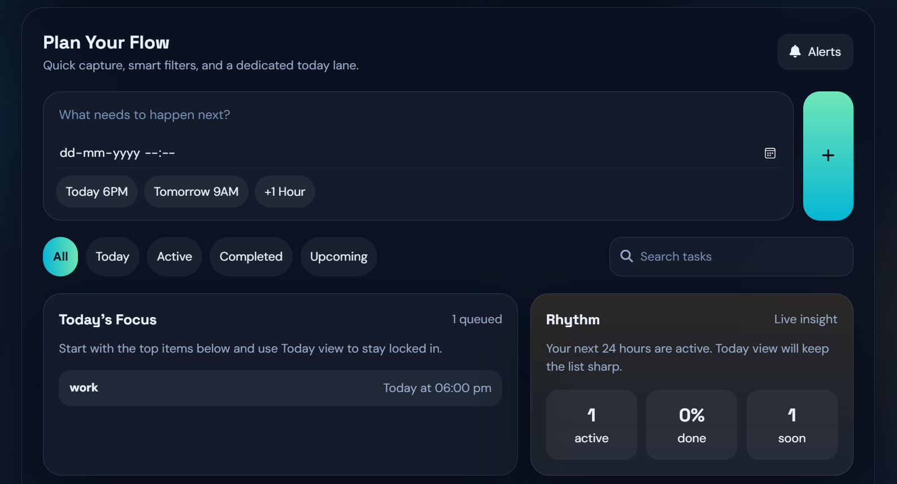

# TaskMaster - Daily Flow Planner

TaskMaster is a polished browser-based task manager built with HTML, CSS, and vanilla JavaScript. It includes quick task capture, due-date planning, reminders, a Today view, search, local persistence, and a live dashboard for daily progress.

## Features

- Add, edit, delete, complete, and reorder tasks.
- Set due dates with a date picker or quick shortcuts.
- Filter by All, Today, Active, Completed, and Upcoming.
- Search tasks without losing the current filter context.
- Track due-today, completed-today, overdue, active, upcoming, and completion-rate stats.
- See a focused Today queue with the most urgent items.
- Persist tasks and notification settings in local storage.
- Receive browser reminders and optional reminder sounds.
- Configure reminder timing, sound, and volume.
- Use responsive layouts across desktop and mobile.

## How to Use

1. Open `index.html` in a modern web browser.
2. Type a task and press Enter or click the plus button.
3. Optionally add a due date manually or with one of the quick date buttons.
4. Use filters, search, and the Today panel to focus the list.
5. Double-click task text or click the edit button to rename a task.
6. Drag tasks in the All view to reorder them.
7. Click Alerts to configure browser notifications and sound.

## Notification Notes

Browser notifications require permission from the browser. If permission is denied, TaskMaster still shows in-app reminder toasts. Sound preview and reminder sound use `notification-sound.mp3`, with a simple generated fallback if the file cannot load.

## Technologies Used

- HTML5
- CSS3
- JavaScript
- Local Storage API
- Browser Notifications API
- Font Awesome
- Google Fonts

## Deployment

This is a static app and can be served from any static host. The included GitHub Pages workflow deploys the repository contents from the `main` branch.

## License

MIT License

Copyright (c) 2025 Sameer Shukla
